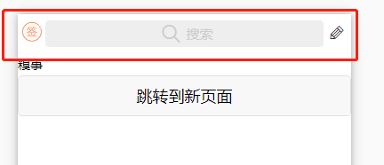
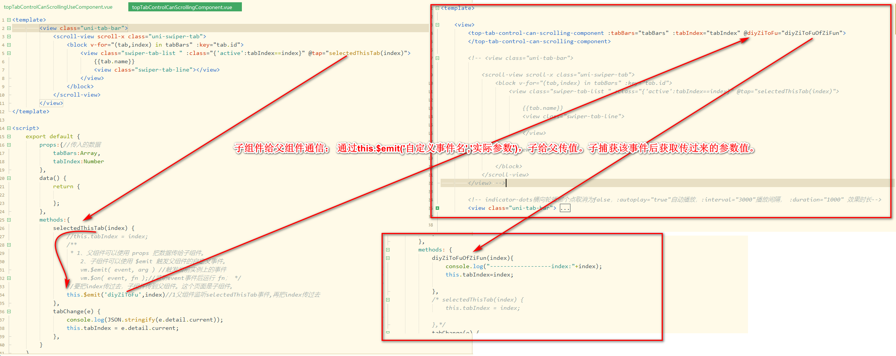
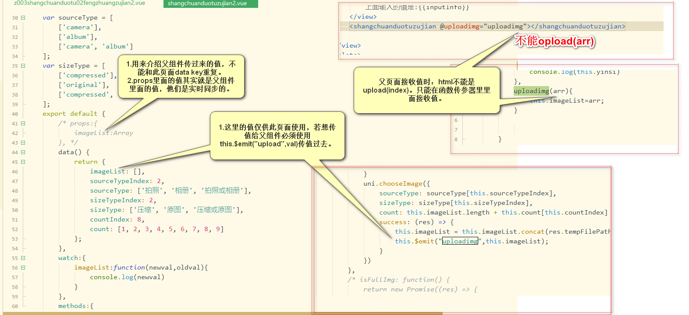
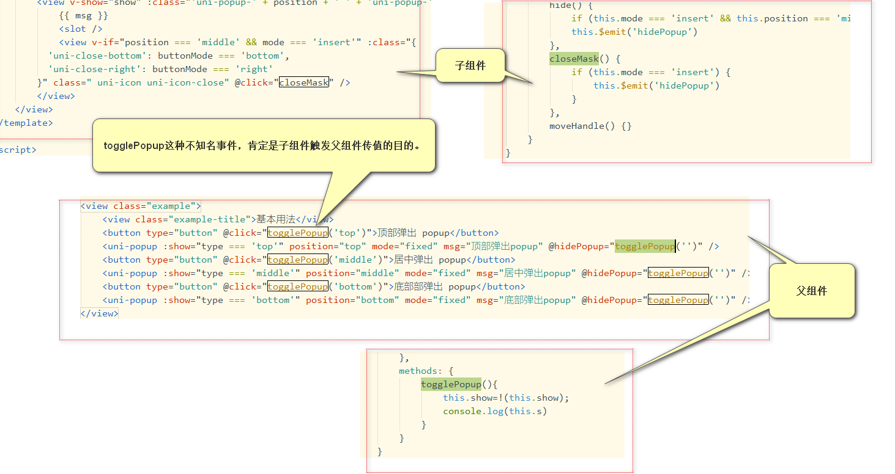
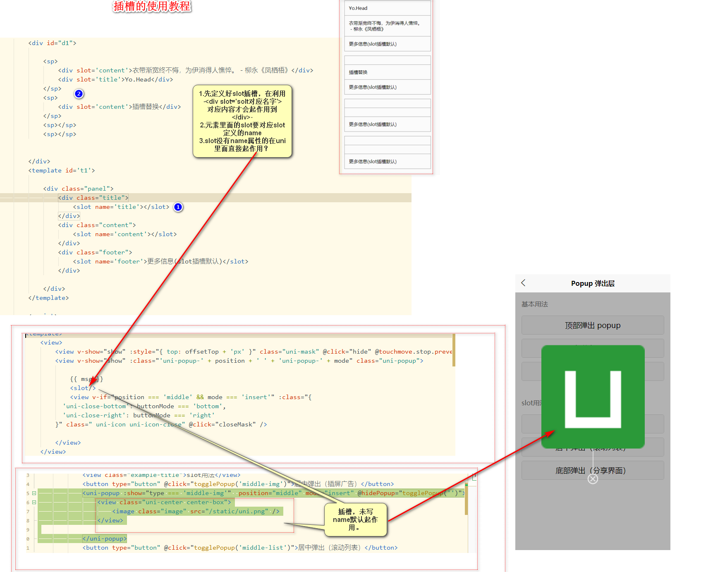

# app小程序开发学习

## cms
```
CddAppLoginController.java
CddUploadFileController.java
CddFsFileupload.java
CddAliyunOssCallbackServer.java


```


## uni的学习[gitee练手项目仓库-仿糗事百科](https://gitee.com/xutaocc/uni-fangqiubai.git)
### 项目架构 [链接](https://uniapp.dcloud.io/frame?id=目录结构)
选择ide插件
1. 设置换行
2. 始终保持一个view
3. 嵌套文件夹 创建页面
4. 第一个是启动页面首页 省略vue
5. globalStyle全局样式
6. main.js 同用js
7. 7unihello-platforms中1.app-plus 和2. mp-weixin 发布不同的平台 会对应打包，不是的不打包
8. hybrid里面写html的 用内置浏览器 解析，可以互相通信
### 真机调试
1.微信小程序调试 需要下载 配置微信开发者工具 目录，新建一个小程序，测试号，打开安全设置 开启端口号

2. 真及调试-登录自己的appid 选择真机调试，上传完成后扫码。
3. 支付宝真机调试
  
---
### 实践开始
#### App.vue 导入全局样式 @import './common/uni.css';
#### 快速开发[链接](https://uniapp.dcloud.io/snippet)
#### 引入图标库 -阿里巴巴图标库[图标库](https://www.iconfont.cn/)
> 
> 使用iconfont.css 删除不必要的url 保留;
> 
> 
> 建议使用upx代替px 1upx约等于30px；

#### css3动画库[animate-css动画](https://daneden.github.io/animate.css/)

```html

<template>
	<view>
		<view class="icon iconfont icon-tiaoshi animated fadeInDown" style="font-size: 50px;color: #007AFF;">
			
		</view>
	</view>
</template>

```

> 首页是加载完后显示，所有首页看不出动画效果
> 使用方法 加入对应class
> 
> 
#### 跳转组件[组件文档](https://uniapp.dcloud.io/component/navigator)

```js
<template>
	<view>
		<navigator url="../ceshi/ceshi" hover-class="navigator-hover">
			<!-- <view class="">跳转测试页</view> -->
			<button type="default">跳转到新页面</button>
		</navigator>

	</view>
</template>

```

> 相当于a标签
>  
#### pages.json 配置globalStyle全局样式[api文档地址](https://uniapp.dcloud.io/collocation/pages?id=globalstyle)

> 用于设置应用的状态栏、导航条、标题、窗口背景色等。
> 

#### 全局的上拉刷新和下拉加载(一般在子页面各自定义，全局用的少)
> 

#### 底部栏的使用[底部栏api](https://uniapp.dcloud.io/collocation/pages?id=tabbar)
>
> 在pages.json里面配置
> tabBar 中的 list 是一个数组，只能配置最少2个、最多5个 tab，tab 按数组的顺序排序。
> tabbar 切换第一次加载时可能渲染不及时，可以在每个tabbar页面的onLoad生命周期里先弹出一个等待雪花（hello uni-app使用了此方式）
> tabbar 的页面展现过一次后就保留在内存中，再次切换 tabbar 页面，只会触发每个页面的onShow，不会再触发onLoad。
>> 在pages里面新建了页面如果删除，在pages.json里面的pages里面也要删除不然会报错


```js
	"globalStyle": {
		"navigationBarTextStyle": "black",
		"navigationBarTitleText": "Hello uniapp",
		"navigationBarBackgroundColor": "#F8F8F8",
		"backgroundColor": "#F8F8F8",
		"backgroundColorTop": "#F4F5F6",
		"backgroundColorBottom": "#F4F5F6",
		"mp-alipay": {
			"titleBarColor": "#FFFFFF"
		}
	},
	"tabBar": {
		"color": "#7A7E83",//tab 上的文字默认颜色
		"selectedColor": "#007AFF",//tab 上的文字选中时的颜色
		"borderStyle": "black",//tabbar 上边框的颜色，仅支持 black/white
		"backgroundColor": "#F8F8F8",//tab 的背景色
		"list": [{//tab 的列表，详见 list 属性说明，最少2个、最多5个 tab
				"pagePath": "pages/tabBar/component/component",//页面路径，必须在 pages 中先定义
				"iconPath": "static/component.png",//图片路径，icon 大小限制为40kb，建议尺寸为 81px * 81px，当 postion 为 top 时，此参数无效，不支持网络图片，不支持字体图标

				"selectedIconPath": "static/componentHL.png",//选中时的图片路径，icon 大小限制为40kb，建议尺寸为 81px * 81px ，当 postion 为 top 时，此参数无效
tabbar常见问题
				"text": "内置组件"//tab 上按钮文字，在 5+APP 和 H5 平台为非必填。例如中间可放一个没有文字的+号图标
			},
			{
				"pagePath": "pages/tabBar/API/API",
				"iconPath": "static/api.png",
				"selectedIconPath": "static/apiHL.png",
				"text": "接口"
			}, {
				"pagePath": "pages/tabBar/extUI/extUI",
				"iconPath": "static/extui.png",
				"selectedIconPath": "static/extuiHL.png",
				"text": "扩展组件"
			}, {
				"pagePath": "pages/tabBar/template/template",
				"iconPath": "static/template.png",
				"selectedIconPath": "static/templateHL.png",
				"text": "模板"
			}
		]
	}

```

#### 底部栏图标的使用[阿里巴巴图标库](https://www.iconfont.cn/)

> 

#### view和text组件的基本使用
> 1.hover-class伪类选择器的使用
> 2.text中\n换行，以及:selectable="false" 文字是否可以选择。

```html

<template>
	<view class="feedback-body">
		demo
		<view class="view-box animated " hover-class="view-box-hover rubberBand" hover-stay-time="800">
			伪类选择器的使用
			
		</view>
		<view>
			<text :selectable="true">:selectable="false" 需要有冒号表示设置属性值，true为boolean是是显示为黄色的。true为添加，false不添加，为vue语法 \n </text>
			<text :selectable="false">这是text\n 这是text这是text\n 这是text\n 这是text\n </text>
			
		</view>
	</view>
</template>

<script>
	export default {
		data() {
			return {
				
			}
		},
		methods: {
			
		}
	}
</script>

<style>
.view-box{
	width: 200upx;
	height: 200upx;
	background-color: #007AFF;
	color: #F1F1F1;
	margin: 100upx;
}
.view-box-hover{
	background-color: #1AAD19;
}
</style>


```

#### css的选择器
> 

```
:nth-child(n)	p:nth-child(2)	选择每个p元素是其父级的第二个子元素	3
:nth-last-child(n)	p:nth-last-child(2)	选择每个p元素的是其父级的第二个子元素，从最后一个子项计数	3
:nth-of-type(n)	p:nth-of-type(2)	选择每个p元素是其父级的第二个p元素	3
:nth-last-of-type(n)	p:nth-last-of-type(2)	选择每个p元素的是其父级的第二个p元素，从最后一个子项计数	3


/* .css3-box>view:nth-of-type(1){
	background-color: #09BB07;
}
.css3-box>view:nth-of-type(5){//选择每个view元素是其父级的第二个view元素	
	background-color: #3F536E;
} */
/* .css3-box>view:nth-of-type(even){//偶数//2n
	background-color: #09BB07;
}
.css3-box>view:nth-of-type(odd){//奇数//2n-1
	background-color: #3F536E;
} */
 .css3-box>view:nth-child(2){//选择每个view元素是其父级的第二个子元素
	background-color: #09BB07;
} 
//:first-child	p:first-child	指定只有当<p>元素是其父级的第一个子级的样式。
//:first-of-type	p:first-of-type	选择每个p元素是其父级的第一个p元素
//:last-of-type	p:last-of-type	选择每个p元素是其父级的最后一个p元素
//:last-child	p:last-child	选择每个p元素是其父级的最后一个子级。

```

#### flex弹性布局[Flex布局](https://uniapp.dcloud.io/frame?id=flex布局) [理解地址](https://uniapp.dcloud.io/h5/pages/component/view/view)
> 详解见学习项目

```html

	display:flex;//在父级元素定义
	//flex-wrap: wrap;//正常正向换行,超出的挤到下面来,往下填充
	//flex-wrap: wrap-reverse;//反向换行,超出的挤到上面去,往上填充

	justify-content: center;//中间对齐
	//justify-content:space-between;//两端对齐
	//justify-content:flex-start;//排在容器的前面即 左边-*默认
	//justify-content:flex-end;//排在容器的后面即 右边
	
	//align-items: center;//拉伸高度至flex容器,子元素不能设置高度
	align-items: center;	//理解为上下对齐	
    flex-direction: column;//flex成员排列顺序,默认column从上到下

	 2. 不被压缩
	 flex-shrink: 0;//0表示不被压缩
	 //flex-shrink: 1;//1表示压缩-默认


	 2. 宽度不够-平均分配
		1.宽度设置50%；
		2.设置flex:1 比例问题，所占多少。为第二个设置占两份
		
		1.宽度设置50%；
		2.设置flex:1 比例问题，所占多少。为第二个设置占两份
		3.把其中第二一设置下来 align-self: flex-end;
		


```
#### 数据渲染、class和style绑定
> {{age>18?'成年人':'未成年'}}
>  :class="classBox"    -直接数据写法
> <view class="boxQiu" :class="[age>18?class1:'',sex=='男'?class2:'']"> -数组写法
> :class="{'background':isBoolean"语法} -数据对象写法


```
	<!-- 数据渲染 -->
	<view>
		<!-- <view :class="classBox"> 和<view :class="'classBox'"> 区别-->
		<view :class="classBox">
			<view class="">{{itemdata}}</view>
			<view class="">{{itemObj.name}}</view>
			<view class="">{{itemObj.age}}</view>

		</view>
		<button type="default" @tap="modifyClass('box')">修改class样式</button>
		<button type="default" @tap="modifyName('Mr.劣徒')">修改名字</button>
		<view id="boxQiuView">
			<view class="boxQiu" :class="[age>18?class1:'',sex=='男'?class2:'']">
				球
			</view>
		</view>
		<view :class="{'background':isBoolean}">
			:class="{'background':isBoolean"语法}
		</view>
		<view :style="{'font-size':fontSize+'px','color':colorVal}">
			:style="{'font-size':fontSize+'px'}。行内标签官方不建议使用upx,需要使用px。
		</view>
		
	</view>

```

#### 条件渲染-用template
> 相同点：v-if与v-show都可以动态控制dom元素显示隐藏
> 不同点：v-if显示隐藏是将dom元素整个添加或删除，而v-show隐藏则是为该元素添加css--display:none，dom元素还在。

> 建议v-if语法这样写,

```html
uni-app 支持在 template 模板中嵌套 <template/> 和 <block/>，用来进行 列表渲染 和 条件渲染。

<template/> 和 <block/> 并不是一个组件，它们仅仅是一个包装元素，不会在页面中做任何渲染，只接受控制属性。

<template>
    <view>
        <template v-if="test">
            <view>test 为 true 时显示</view>
        </template>
        <template v-else>
            <view>test 为 false 时显示</view>
        </template>
    </view>
</template>

```


#### 列表渲染--block [api](https://uniapp.dcloud.io/use?id=列表渲染)
> 注意事项 :key 一般指定index就可以了
> 循环一维对象
> 循环二维数组
> 循环对象

```
 uni-app 支持在 template 模板中嵌套 <template/> 和 <block/>，用来进行 列表渲染 和 条件渲染。
 <template/> 和 <block/> 并不是一个组件，它们仅仅是一个包装元素，不会在页面中做任何渲染，只接受控制属性。
 
<template>
    <view>
        <block v-for="(item,index) in list" :key="index">
            <view>{{item}} - {{index}}</view>
        </block>
    </view>
</template>

```

```html

<template>
	<!-- 列表渲染 -->
	<view>
		<!-- 循环一维对象 -->
		<view class="box">
			<view class="" v-for="(val,index) in dataArr" :key="index">
				值:{{val}}---索引{{index}}
			</view>
		</view>
		
		<!-- 循环二维数组 -->
		<view class="box2">
			<view class="" v-for="(val1,index1) in difangNestArr" :key="index1">
				<view >{{val1.name}}</view>
				<view v-for="(val2,index2) in val1.list" :key="index2">
					{{index2}}-{{val2}}

				</view>
			</view>
		</view>
		<!-- 循环对象 -->
		<block v-for="(val,key) in objCyclic" :key="key">
			<view class="" >
				{{key}}-{{val}}
			</view>
		</block>
	</view>
</template>

<script>
	export default {
		data() {
			return {
				dataArr:["篮球","乒乓球","轮滑","游泳"],
				difangNestArr:[
					{name:'安徽',list:['合肥','芜湖','蚌埠']},
					{name:'江苏',list:['南京','苏州','无锡']},
					{name:'浙江',list:['杭州','宁波','温州']},
				],
				objCyclic:{
					name1:'张三',
					name2:'李四',
					name3:'王五',
				}
				
			}
		},
		methods: {
			
		}
	}
</script>

<style>
.box{
	background: #0A98D5;
}
.box2{
	background: #1AAD19;
}
</style>


```


#### 事件处理器[api](https://uniapp.dcloud.io/use?id=事件处理器)

> @tap.stop="bax2Tap()"阻止事件的冒泡
> 理解：外面是金字塔底座，里面是金字塔顶点。顶尖层级优先，点了里面先触发里面事件再触发外面事件。
> 要想阻止里面是事件 冒泡到外面来，需要在里面添加 阻止冒泡事件。
```
		<view class="box1" @tap="bax1Tap()">
			外面	
			<view class="box2" @tap.stop="bax2Tap()">
				里面
			</view>
		</view>

```
#### 监听属性watch

```js
	export default {
		data() {
			return {
				num:0,
				
			}
		},
		methods: {
			startFun(){
				this.num++;
			}
		},
		watch:{//  // 如果 `question` 发生改变，这个函数就会运行
			num:function(newVal,OldVal){
				console.log('OldVal:'+OldVal);
				console.log('newVal:'+newVal);
			}
		}
	}

```

#### 计算属性
> 计算属性写法,计算属性缓存更有利于提高效率，利于维护
> 计算属性是返回值，不能当作函数，不能有()


```html

<template>
	<!-- 计算属性 -->
	<view>
		<!-- 需求：重量>1000用kg计量，否则用g -->
		<!-- 普通写法 -->
		<view class="">
			{{num>1000?(num/1000+'kg'):num+'g'}}
		</view>
		<!-- 计算属性写法,计算属性缓存更有利于提高效率，利于维护 -->
		<!-- 计算属性是返回值，不能当作函数，不能有() -->
		<view class="">
			{{zhuanHuanKg}}
		</view>
	</view>
</template>

<script>
	export default {
		data() {
			return {
				num:15000,
			}
		},
		methods: {
			
		},
		computed:{
			zhuanHuanKg:function(){
				return this.num>1000?(this.num/1000+'kg'):this.num+'g';
			}
			
		}
	}
</script>

<style>

</style>


```


#### pages.json的配置
##### style配置项，顶部栏按钮等[api](https://uniapp.dcloud.io/collocation/pages?id=style)
`app-plus	Object		设置编译到 App 平台的特定样式，配置项参考下方 app-plus	App`
  
> 配置顶部栏button图标
> 

```js

{
	"pages": [ //pages数组中第一项表示应用启动页，参考：https://uniapp.dcloud.io/collocation/pages
		
		{
			"path": "pages/index/index",
			"style": {
				"navigationBarTitleText": "糗事首页",
				"app-plus":{
					"scrollIndicator":"none",//滚动条显示策略，设置为 "none" 时不显示滚动条。
					"titleNView":{//导航栏 ，详见:导航栏
						"searchInput":{//原生导航栏上的搜索框配置，详见：searchInput
							"align":"center",
							"backgroundColor":"#EEEEEE",
							"borderRadius":"4px",//搜索框圆角
							"placeholder":"搜索",//搜索框提示
							"placeholderColor":"#CCCCCC",//提示紫颜色
							"disabled":false//false可以编辑,true不可以编辑
							
						},
						//配置按钮
						"buttons":[//自定义按钮，详见 buttons
							//左边
							{
								//"type":"back",//type默认为none，为none可以自己替换图标。
								"color":"#FF9619",
								"colorPressed":"#BBBBBB",
								"float":"left",
								"fontSize":"22px",
								"fontSrc":"/static/font/iconfont.ttf",
								"text":"\ue606"
								
							},
							//右边
							{
								"color":"#000000",
								"colorPressed":"#BBBBBB",
								"float":"right",
								"fontSize":"22px",
								"fontSrc":"/static/font/iconfont.ttf",
								"text":"\ue61c"
								
							}
						]
						
					}
					
				}
			}
		}

		, {
			"path": "pages/news/news",
			"style": {}
		}, 


```

#### 图文视频列表样式
> flex的公共style样式的抽取，以及公共样式引导到App.vue全局 

>  
> 颜色透明度的调法 


#### *封装列表样式组件*
##### 一、简单的本页面循环输出

```html

<template>
	<view>
		<block v-for="(item,index) in list" :key="index">

			<view class="index-list">
				<view class="index-list1 u-f-ac u-f-jsd">
					<view class="u-f-ac">
						<image :src="item.userpic" mode="widthFix" lazy-load></image>
						{{item.username}}
					</view>
					<view class="u-f-ac" v-show="!(item.isGuanZhu)">
						<view class="icon iconfont icon-icon-test"></view>关注
					</view>

				</view>
				<view class="index-list2">{{item.title}}</view>
				<view class="index-list3 u-f-ajc">
					<image :src="item.titlePic" mode="widthFix" lazy-load></image>
					<!-- 视频播放图标 -->
					<view class="icon iconfont icon-bofang index-list-play" v-show="item.tytle=='video'"></view>
					<!-- 视频信息 -->
					<view class="index-list-playinfo">
						{{item.playNum}}播放 {{item.playLong}}
					</view>
				</view>
				<view class="index-list4 u-f-ac u-f-jsd">
					<view class="u-f-ajc">

						<view class="u-f-ajc " :class="{'active':(item.infoNum.index)==1?true:false}">
							<view class="icon iconfont icon-xiaolian1"></view>{{item.infoNum.dingNum}}
						</view>
						<view class="u-f-ajc" :class="{'active':(item.infoNum.index)==2?true:false}">
							<view class="icon iconfont icon-kulian"></view>{{item.infoNum.caiNum}}
						</view>

					</view>
					<view class="u-f-ajc">
						<view class="u-f-ajc">
							<view class="icon iconfont icon-ziyuan1"></view>{{item.commentNum}}
						</view>
						<view class="u-f-ajc">
							<view class="icon iconfont icon-zhuanfa"></view>{{item.shareNum}}
						</view>

					</view>

				</view>

			</view>

		</block>

	</view>
</template>

<script>
	export default {
		data() {
			return {
				list: [{
						userpic: "../../../static/touxiang/touxiang1.jpg", //头像图标地址
						username: "Mr.劣徒", //用户名
						isGuanZhu: false, //是否已经关注
						title: "美丽的风景", //文章标题
						tytle: "img", //img图文,video视频
						titlePic: "../../../static/sucai/tu4.jpeg", //文章大照片
						playNum: "20w",
						playLong: "2:47",
						infoNum: {
							index: 2, //0没有操作，1顶 2踩
							dingNum: 1001,
							caiNum: 541121,
						},
						commentNum: 10, //评论数
						shareNum: 10, //分享数

					},
					{
							userpic: "../../../static/touxiang/touxiang2.jpg", //头像图标地址
							username: "启明", //用户名
							isGuanZhu: true, //是否已经关注
							title: "welcome to 上海", //文章标题
							tytle: "video", //img图文,video视频
							titlePic: "../../../static/sucai/tu4.jpeg", //文章大照片
							playNum: "200w",
							playLong: "5:22",
							infoNum: {
								index: 1, //0没有操作，1顶 2踩
								dingNum: 6521545,
								caiNum: 2112,
							},
							commentNum: 10, //评论数
							shareNum: 10, //分享数
					
						},
						{
								userpic: "../../../static/touxiang/touxiang3.jpg", //头像图标地址
								username: "苏露", //用户名
								isGuanZhu: false, //是否已经关注
								title: "welcome to 昆明", //文章标题
								tytle: "video", //img图文,video视频
								titlePic: "../../../static/sucai/tu5.jpeg", //文章大照片
								playNum: "200w",
								playLong: "5:22",
								infoNum: {
									index: 0, //0没有操作，1顶 2踩
									dingNum: 81545,
									caiNum: 612,
								},
								commentNum: 1210, //评论数
								shareNum: 102, //分享数
						
							}

				]

			}
		},
		methods: {

		}
	}
</script>

<style>
	.index-list {
		padding: 20upx;
		border-bottom: 1upx solid #BEBEBE;
	}

	.index-list1 {
		/* display: flex;
	justify-content: space-between;
	align-items: center; */
	}

	.index-list1>view:first-child {
		/* display: flex;
	//justify-content: center;
	align-items: center; */
		color: #A8A8A8;
	}

	.index-list1>view:last-child {
		/* display: flex;
	//justify-content: center;
	align-items: center; */
		background: #DDDDDD;
		border-radius: 5upx;
		padding-left: 15upx;
		padding-right: 15upx;
	}

	.index-list1>view:last-child>view {}

	.index-list1>view:first-child image {
		width: 90upx;
		height: 90upx;
		border-radius: 100%;
		margin-right: 10upx;
	}

	.index-list2 {
		padding-top: 15upx;
		font-size: 30upx;
	}

	.index-list3 {
		position: relative;
		padding-top: 15upx;
	}

	.index-list3>image {
		width: 100%;
		border-radius: 18upx;
	}

	.index-list3 .index-list-play {
		position: absolute;
		font-size: 100upx;
		color: #FFFFFF;

	}

	.index-list3 .index-list-playinfo {
		position: absolute;
		background: rgba(51, 51, 51, 0.85);
		color: #FFFFFF;
		border-radius: 20upx;
		padding-left: 15upx;
		padding-right: 15upx;
		bottom: 8upx;
		right: 8upx;
	}

	.index-list4 {
		color: #A8A8A8;
		padding: 15upx 0upx;
		/* display: flex;
	justify-content: space-between;
	align-items: center; */
	}

	.index-list4>view:first-child {
		/* display: flex;
	justify-content: center; */
	}

	.index-list4>view:last-child {
		/* display: flex;
	justify-content: center; */
	}

	.index-list4>view>view {
		/* display: flex;
	justify-content: center; */
	}

	.index-list4>view>view>view {
		margin-right: 5upx;
	}

	.index-list4>view>view:first-child {
		margin-right: 15upx;
	}
	.index-list4 .active, .index-list4 .active>view{
		color: #09BB07;
	}
</style>


```
##### *二、组件的抽取和父子组件*
> 在组件中的style标签上：添加style作用域，添加了 scoped表示此样式只能在此组件起作用，其他地方不起作用
> 
> 参见 `indexOfComponentPackage2.vue`

> 父子组件的认识(后期会涉及到父子组件的通信)

>  
>组件名和标签名的一致性
>  

#### 横向滚动选项卡tab切换
##### scroll-view可滚动视图区域[api](https://uniapp.dcloud.io/component/scroll-view)。
> 快捷键uscrollView
> topTabControlCanScrolling.vue
> 


##### swiper滑块视图容器[api](https://uniapp.dcloud.io/component/swiper)
> 可以做轮播图，顺便做一起滑动
> 快捷键uSwiper
> 注意：使用竖向滚动时，需要给 <scroll-view> 一个固定高度，通过 css 设置 height。**用uniapp提供的接口计算出窗口高度。
> 动态计算的px，要用px不能用upx

> 获取系统信息[api](https://uniapp.dcloud.io/api/system/info?id=getsysteminfo),需要用es6写法不然报错

```js

uni.getSystemInfo({
    success: function (res) {
        console.log(res.model);
        console.log(res.pixelRatio);
        console.log(res.windowWidth);
        console.log(res.windowHeight);
        console.log(res.language);
        console.log(res.version);
        console.log(res.platform);
    }
});


		onLoad() {
			uni.getSystemInfo({//获取系统信息
				/* 这里es5写法报错function(res){}，用es6写正确的 (res) =>*/
				success: (res) => {
					console.log(this.swiperHeight);
					let height = res.windowHeight - uni.upx2px(100);
					this.swiperHeight = height;
				}
			});
		},
		
```
> swiper>>current	Number	0	当前所在滑块的 index 
> @change	滑块改变上面的顶部栏也改变。 current 改变时会触发 change 事件，event.detail = {current: current, source: source}
#### 封装顶部滚动栏导航组件。
> topTabControlCanScrollingComponent.vue-子组件模板
> topTabControlCanScrollingUseComponent.vue-父组件实现
##### 组件封装
> 

##### 子父通信
> 子组件给父组件通信： 通过this.$emit('自定义事件名','实际参数')，子给父传值。子捕获该事件后获取传过来的参数值。
> 

#### 上拉加载
> 参考 pullUpToLoadMore1.vue


> "bounce":"vertical",//配置反弹效果，none没有效果
>
> @scrolltolower="loadMore(index)"  绑定触底事件

#### 上拉加载组件的封装


#### 优化图文列表组件 
##### 加载动画  animated fadeInLeft
##### [官方提示接口](https://uniapp.dcloud.io/api/ui/prompt)
##### 顶和踩的逻辑
```js
		methods: {
			/* 关注事件 */
			guanzhu() {
				this.item.isGuanZhu = true;
				uni.showToast({ //官方提示接口
					title: "关注成功",

				});
			},
			caozuo(type) {
				switch (type) {
					case "ding":
						if (this.item.infoNum.index == 1) {
							return;
						}
						this.item.infoNum.dingNum++;
						if (this.item.infoNum.index == 2) {
							this.item.infoNum.caiNum--;
						}
						this.item.infoNum.index = 1
						break;
					case "cai":
						if (this.item.infoNum.index == 2) {
							return;
						}
						this.item.infoNum.caiNum++;
						if (this.item.infoNum.index == 1) {
							this.item.infoNum.dingNum--;
						}
						this.item.infoNum.index = 2
						break;
					default:
						break;
				}


			},
			/* 进入详情页 */
			openDetail() {
				console.log("进入详情页");

			}
		}
		
```
#### 封装无数据默认组件
> 这里什么都没有图片

#### 搜索页的开发

> "autoFocus":true//自动获取焦点
##### 搜索栏事件的监听。[页面生命周期](https://uniapp.dcloud.io/frame?id=页面生命周期)
> 
> onNavigationBarSearchInputClicked 监听原生标题栏搜索输入框点击事件,搜索框设置为true不可以编辑才起作用。("disabled" : true //false可以编辑,true不可以编辑)。
> onNavigationBarButtonTap 监听原生标题栏按钮点击事件，用于在搜索页确定输入还是取消 按钮

##### uni.navigateTo(OBJECT)  [路由](https://uniapp.dcloud.io/api/router?id=navigateto)
##### navigateback [后退功能](https://uniapp.dcloud.io/api/router?id=navigateback)
##### 设置取消后退键，page.json里面的app-plus[常用](https://uniapp.dcloud.io/collocation/pages?id=app-plus) [更多](https://www.html5plus.org/doc/zh_cn/webview.html#plus.webview.WebviewStyles)

`autoBackButton: (Boolean 类型 )标题栏控件是否显示左侧返回按钮。可取值： "true" - 显示返回按钮； "false" - 不显示返回按钮。 默认值为"false"。`

#### 自定义导航栏的开发
> z001FaBuYe.vue
>> onNavigationBarButtonTap 原生标题点击事件，用于监听顶部左右按钮事件
>> uni.navigateTo 路由方法
```

		//监听 监听原生标题栏按钮点击事件
		onNavigationBarButtonTap:(e)=>{
			console.log("触发了按钮："+e.index);
			switch (e.index){
				case 0:
					//原生方法 路由
					uni.navigateTo({
						url:"../z001FaBuYe/z001FaBuYe"
					})
				
					break;
				case 1:
					break;
				case 2:
					break;
				default:
					break;
			} 
		}

```

##### 自定义导航

> 学会参照官方自定义导航，使用其写好的组件。复制三个组件过来
>  
> 每个页面均支持通过配置 titleNView:false 来禁用原生导航栏。[api](https://uniapp.dcloud.io/collocation/pages?id=app-plus)

> 自定义返回多少级

```js
		methods: {
			back(){
				console.log("触发左边的点击事件");
				//定义返回事件
				uni.navigateBack({
					delta: 1//返回一级
				})
			},
			submit(){
				console.log("触发右边的点击事件");
			},
			changeLook(){
				console.log("改变事件")
			}
		}
```


> [底部弹出选择-交互接口](https://uniapp.dcloud.io/api/ui/prompt?id=showactionsheet)，显示菜单
> 千万不能用  function，否则this不起作用

```js
				uni.showActionSheet({
				    itemList:changeLookInfo,// ['所有人可见', '仅仅自己可见', 'C'],
				    success:  (res)=> {//千万不能用  function，否则this不起作用
						console.log(changeLookInfo[res.tapIndex])
						this.yinsi=changeLookInfo[res.tapIndex];
				        console.log('选中了第' + (res.tapIndex + 1) + '个按钮');
						console.log(this.yinsi)
				    },
				    fail: function (res) {
				        console.log(res.errMsg);
				    }
				});

````
> 

> [textarea的用法](https://uniapp.dcloud.io/component/textarea)
> 官方样式

```js
		<view class="uni-textarea">
			<textarea class="textareaClass" v-model="inputInfo"  placeholder="请输入吧" />
		</view>
		<view class="" >
			上面输入的值是:{{inputInfo}}
		</view>
		
```
#### 上传多图功能开发
> z003shangchuanduotu01.vue/参照官方例子复制过来样式和方法
> [模态框提示确认](https://uniapp.dcloud.io/api/ui/prompt?id=showmodal)

```js
<template>
	<view>
		<!-- 
		:statusBar="true" //不要放在最上面，留点空给图标提示。 statusBar 有冒号是vue属性绑定，true有，false没有。没有冒号直接赋值。
		title="标题"  可以删除。在里面写 
		
		-->
		<uni-nav-bar left-icon="back" :statusBar="true" rightText="发布" @click-right="submit" @click-left="back">
			<view class="u-f-ajc " @tap="changeLook">
				{{yinsi}}
				<view class="icon iconfont icon-gengduo">

				</view>

			</view>
		</uni-nav-bar>

		<view class="uni-textarea">
			<textarea class="textareaClass" v-model="inputInfo" placeholder="请输入吧" />
			</view>
		<view class="" >
			上面输入的值是:{{inputInfo}}
		</view>
		
		<!-- 上传多图 -->
<view class="uni-list list-pd">
					<view class="uni-list-cell cell-pd">
						<view class="uni-uploader">
							<view class="uni-uploader-head">
								<view class="uni-uploader-title">点击可预览选好的图片</view>
								<view class="uni-uploader-info">{{imageList.length}}/9</view>
							</view>
							<view class="uni-uploader-body">
								<view class="uni-uploader__files">
									<block v-for="(image,index) in imageList" :key="index">
										<view class="uni-uploader__file">
											<!-- diy加个删除图标  -->
											<image class="uni-uploader__img" :src="image" :data-src="image" @tap="previewImage"></image>
											<view class=" iconfont icon-shanchu diy-ico-shangchu"  @tap="deleteImg(index)"></view>
											
										
										</view>
									</block>
									<view class="uni-uploader__input-box">
										<view class="uni-uploader__input" @tap="chooseImage"></view>
									</view>
								</view>
							</view>
						</view>
					</view>
				</view>
	</view>
</template>

<script>
	import uniNavBar from "../../../components/uni-nav-bar/uni-nav-bar.vue";
	import uniIcon from '../../../components/uni-icon/uni-icon.vue';
	let changeLookInfo=["所有人可见","仅自己可见"];
	var sourceType = [
		['camera'],
		['album'],
		['camera', 'album']
	];
	var sizeType = [
		['compressed'],
		['original'],
		['compressed', 'original']
	];	
	export default {
		components: {
			uniNavBar,
			uniIcon
		},
		data() {
			return {
				yinsi:"请选择",
				inputInfo:"i love you",
				imageList: [],
				sourceTypeIndex: 2,
				sourceType: ['拍照', '相册', '拍照或相册'],
				sizeTypeIndex: 2,
				sizeType: ['压缩', '原图', '压缩或原图'],
				countIndex: 8,
				count: [1, 2, 3, 4, 5, 6, 7, 8, 9]
			}
		},
		methods: {
			back(){
				console.log("触发左边的点击事件");
				//定义返回事件
				uni.navigateBack({
					delta: 1//返回一级
				})
			},
			submit(){
				console.log("触发右边的点击事件");
				
			},
			changeLook(){
				console.log("改变事件");
				uni.showActionSheet({
				    itemList:changeLookInfo,// ['所有人可见', '仅仅自己可见', 'C'],
				    success:  (res)=> {//千万不能用  function，否则this不起作用
						console.log(changeLookInfo[res.tapIndex])
						this.yinsi=changeLookInfo[res.tapIndex];
				        console.log('选中了第' + (res.tapIndex + 1) + '个按钮');
						console.log(this.yinsi)
				    },
				    fail: function (res) {
				        console.log(res.errMsg);
				    }
				});
				console.log(this.yinsi)
			},
			chooseImage: async function() {
					if (this.imageList.length === 9) {
						console.log("有了9张，不可再选")
						return;
						/* let isContinue = await this.isFullImg();
						console.log("是否继续?", isContinue);
						if (!isContinue) {
							return;
						} */
					}
					uni.chooseImage({
						sourceType: sourceType[this.sourceTypeIndex],
						sizeType: sizeType[this.sizeTypeIndex],
						count: this.imageList.length + this.count[this.countIndex] > 9 ? 9 - this.imageList.length : this.count[this.countIndex],
						success: (res) => {
							this.imageList = this.imageList.concat(res.tempFilePaths);
						}
					})
				},
				/* isFullImg: function() {
					return new Promise((res) => {
						uni.showModal({
							content: "已经有9张图片了,是否清空现有图片？",
							success: (e) => {
								if (e.confirm) {
									this.imageList = [];
									res(true);
								} else {
									res(false)
								}
							},
							fail: () => {
								res(false)
							}
						})
					})
				}, */
				previewImage: function(e) {
					var current = e.target.dataset.src
					uni.previewImage({
						current: current,
						urls: this.imageList
					})
				},
				deleteImg(index){
					uni.showModal({
					    title: '提示',
					    content: '确定要删除吗',
					    success:  (res) =>{
					        if (res.confirm) {
					            console.log('用户点击确定');
								//删除照片
								this.imageList.splice(index,1);
					        } else if (res.cancel) {
					            console.log('用户点击取消');
					        }
					    }
					});
				}
		}
	}
</script>

<style>
.textareaClass{
	border: 1upx solid #929292;
	
	
}
.textareaView{
	display: flex;
	justify-content: center;
}
	.cell-pd {
		padding: 22upx 30upx;
	}

	.list-pd {
		margin-top: 50upx;
	}
.uni-uploader__file{
	position: relative;
}

.icon-shanchu{
	position: absolute;
	right: 0;
	top: 0;
	background: rgba(51, 51, 51, 0.84);
	color: #FFFFFF;
	border-radius: 10upx;
	padding: 2upx 8upx;

	
}
</style>


```
#### 上传多图组件封装(组件封装总结)
> shangchuanduotuzujian2.vue/z003shangchuanduotu02fengzhuangzujian2.vue
>  
> 

### 插槽的使用
> 

### 开发弹出提示框
> 利用HelloUni 扩展组件里面
> 

### 多图上传
> z003shangchuanduotu01.vue

```js

					uni.chooseImage({
						sourceType: sourceType[this.sourceTypeIndex],
						sizeType: sizeType[this.sizeTypeIndex],
						count: this.imageList.length + this.count[this.countIndex] > 9 ? 9 - this.imageList.length : this.count[this.countIndex],
						success: (res) => {
							 this.imageList = this.imageList.concat(res.tempFilePaths);
							/*//console.log(this.imageList);
							var imageSrc = this.imageList;
							 */
							
						var imageSrc = res.tempFilePaths;
						for(var i=0;i<imageSrc.length;i++){
							uni.uploadFile({
								url: 'http://localhost:8088/uploadFile',
								filePath: imageSrc[i],
								fileType: 'image',
								name: 'file',
								success: (res) => {
									console.log('uploadImage success, res is:', res)
									uni.showToast({
										title: '上传成功',
										icon: 'success',
										duration: 1000
									})
									this.imageSrc = imageSrc[i]
								},
								fail: (err) => {
									console.log('uploadImage fail', err);
									uni.showModal({
										content: err.errMsg,
										showCancel: false
									});
								}
							});
						}
						}
					})

```

```java

@RestController
public class SaveUniUpFile {

    @RequestMapping("/uploadFile")

    public String uploadFile(HttpServletRequest request,@RequestParam("file") MultipartFile[] files){//
        System.out.println("到了");
        // 这样就可以收到文件了，files.length == 1.
       System.out.println(files.length);
        System.out.println(files[0].getOriginalFilename());
        // 后续操作省略
        return "上传完成";
    }
}

```

### 保存草稿的页面
> z006baoCunCaoGao.vue/z002ShouYe.vue
>		//监听返回事件onBackPress() {
>	用到数据缓存api[api](https://uniapp.dcloud.io/api/storage/storage?id=setstorage)
>异步提示，需要写控制按钮

```js
				//异步提示，需要写控制按钮
				uni.showModal({
					title: '提示',
					content: '是否要保存为草稿',
					cancelText:'不保存',
					confirmText:'保存',
					success: function (res) {
						if (res.confirm) {
							console.log('用户点击确定');
							
							
						} else if (res.cancel) {
							console.log('用户点击取消');
						}
						uni.navigateBack({
							delta: 1//返回一级
						}) 
						
					}
				});

```
### 修复自定义组件兼容微信小程序
> 配置里面设置兼容微信程序组件
>  
> 组件封装传值的修改，要把props里面的值传到data里面去
> 

> 建议pages里面不要多个文件夹建议一个页面就嵌套一层文件夹，保证微信小程序等兼容。
> 