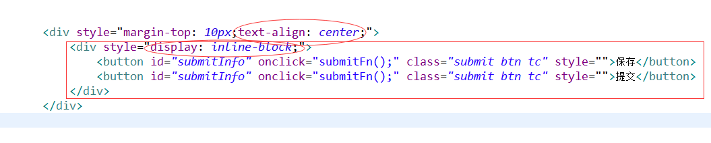

# css

## 两个按钮居中显示行内块[链接](https://blog.csdn.net/qq_37621289/article/details/82827299)
> 父级容器块级元素text-align: center;    子元素需要是行内块；对行内元素和行内块元素起作用，对块级元素不适用。

```css

<div style="margin-top: 10px;text-align: center;">
	<div style="display: inline-block;">
		<button id="submitInfo" onclick="submitFn();" class="submit btn tc" style="">保存</button>
		<button id="submitInfo" onclick="submitFn();" class="submit btn tc" style="">提交</button>
	</div>
</div>

```


