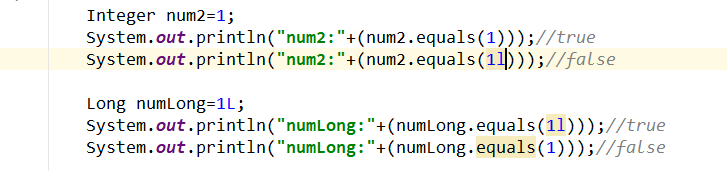

# 1. java基础编程知识


## 1.1. java阿里巴巴Java开发手册

> [阿里巴巴Java开发手册（华山版）.pdf](../_v_attachments/20190819230226593_31917/阿里巴巴Java开发手册（华山版）.pdf)


[toc]
## 1.2. return和break和continue区别
```java
    public void run() {
        for (int i = 0; i < 100; i++) {
            System.out.println(i);
            if(i==50){
                System.out.println("到了50");
                continue;//return结束方法体下面的代码，break跳出当前循环，continue结束此次循环以下代码不会继续执行 下个循环继续
            }
            System.out.println(i+"---");
        }
        System.out.println("循环后面");
    }
```


## 1.3. java常量池[链接](https://www.cnblogs.com/xinfengzi/p/5898484.html)


```
java中常量池技术说的通俗点就是java级别的缓存技术，方便快捷的创建一个对象。当需要一个对象时，从池中去获取（如果池中没有，就创建一个并放入池中），当下次需要相同变量的时候，不用重新创建，从而节省空间。

java八种基本类型的包装类和对象池

java中的基本类型的包装类、其中Byte、Boolean、Short、Character、Integer、Long实现了常量池技术，（除了Boolean，都只对小于128的值才支持）

```

## 1.4. 数据类型== equal
### 1.4.1. l和L区别

```

没有区别。
小写的l在不少字体里显示的和数字1容易混淆。
所以声明长整型是推荐使用 像3223L 这种形式的

```
### 1.4.2. ==和equal区别

```
    ==操作比较的是两个变量的值是否相等，对于引用型变量表示的是两个变量在堆中存储的地址是否相同，即栈中的内容是否相同。

    equals操作表示的两个变量是否是对同一个对象的引用，即堆中的内容是否相同。

    ==比较的是2个对象的地址，而equals比较的是2个对象的内容。

     显然，当equals为true时，==不一定为true；
```

### 1.4.3. equal
1. 非引用类型没有equals方法。int类型.equal报错
> 
2. Integer和数字没有的1L不是一个同一个对象，

2. 

## 1.5. java开发常用规范
### 1.5.1. 命名规范
> 1、 项目名全部小写    如：spring-boot-06-data-mybatis
2、 包名全部小写     com.alibaba.ai.util
3、 类名首字母大写，如果类名由多个单词组成，每个单词的首字母都要大写。
如：public class MyFirstClass{}
4、 变量名、方法名首字母小写，如果名称由多个单词组成，每个单词的首字母都要大写。
如：int index=0;n  public void toString(){}
5、 常量名全部大写
如：public static final String GAME_COLOR=”RED”;
6、所有命名规则必须遵循以下规则：
1)、名称只能由字母、数字、下划线、$符号组成
2)、不能以数字开头
3)、名称不能使用JAVA中的关键字。
4)、坚决不允许出现中文及拼音命名。

---


## 1.6. return和break和continue区别
```java
    public void run() {
        for (int i = 0; i < 100; i++) {
            System.out.println(i);
            if(i==50){
                System.out.println("到了50");
                continue;//return结束方法体下面的代码，break跳出当前循环，continue结束此次循环以下代码不会继续执行 下个循环继续
            }
            System.out.println(i+"---");
        }
        System.out.println("循环后面");
    }
```


## 1.7. java线程


### 1.7.1. java线程的几种创建
+ [创建线程的四种方式-点击学习](https://blog.csdn.net/weixin_41891854/article/details/81265772)
    1. 继承Thread类
    2. 现实Runnable类
    3. 线程池Executor工厂方法
    4. 实现Callable重写call方法


#### 1.7.1.1. 1.extends继承Thread类
```java
public class LockTest {
    /**
     * @param args
     */
    public static void main(String[] args) {

        System.out.println(Thread.currentThread().getName());
        WithdrawMoney withdrawMoney1=new WithdrawMoney();
        withdrawMoney1.start();
        WithdrawMoney withdrawMoney2=new WithdrawMoney();
        withdrawMoney2.start();
    }

}
class WithdrawMoney extends Thread{

    public void run() {
        int i=0;
        while(true){
            System.out.println(Thread.currentThread().getName()+"   "+(i++));
            if(i==100){
                return;
            }
        }

    }
}
```


#### 1.7.1.2. 2.implements实现Runnable接口(可以实现同用一个对象)
```java
public class LockTest {
    /**
     * @param args
     */
    public static void main(String[] args) {

        System.out.println(Thread.currentThread().getName());
        WithdrawMoney withdrawMoney1=new WithdrawMoney(); 
        Thread thread1=new Thread(withdrawMoney1);
        thread1.start();
        Thread thread2=new Thread(withdrawMoney1);
        thread2.start();
    }

}
class WithdrawMoney implements Runnable{
    int i=100;
    public void run() {
        while(true){
            System.out.println(Thread.currentThread().getName()+"   "+(i--));
            if(i==0){
                System.out.println(Thread.currentThread().getName()+"没了"+i);
                return;
            }
        }

    }
}
```


>使用Thread结合Runnable利用匿名内部类简写


```java
public class LockTest {
    /**
     * @param args
     */
    public static void main(String[] args) {

        System.out.println(Thread.currentThread().getName());

        Thread thread1=new Thread(){
            @Override
            public void run() {
                super.run();
            }
        };
        thread1.start();


        new Thread(){
            int i=100;
            public void run() {
                while(true){
                    System.out.println(Thread.currentThread().getName()+"   "+(i--));
                    if(i==0){
                        System.out.println(Thread.currentThread().getName()+"没了"+i);
                        return;
                    }
                }

            }
        }.start();
    }

}
```
> a.实现Runnable接口避免多继承局限   b.实现Runnable()可以更好的体现共享的概念


---

## 1.8. java常用api
### 1.8.1. StringUtiles方法详解-commons-lang-2.6.jar[链接](https://blog.csdn.net/fsp88927/article/details/22059791)

```java
项目中用的StringUtilesdui对文件或者字符串的操作，很强大！

引入plexus-utils-1.4.1.jar或者commons-lang-2.6.jar这两个包里都有StringUtiles.class。后者方法比前者多。具体如下：

public static void TestStr(){
    //null 和 ""操作~~~~~~~~~~~~~~~~~~~~~~~~~~~~~~~~~~~~~
    //判断是否Null 或者 ""
    //System.out.println(StringUtils.isEmpty(null));
    //System.out.println(StringUtils.isNotEmpty(null));
    //判断是否null 或者 "" 去空格~~~~~~~~~~~~~~~~~~~~~~~~~~~~~~~~~~
    //System.out.println(StringUtils.isBlank("  "));
    //System.out.println(StringUtils.isNotBlank(null));
    //去空格.Null返回null~~~~~~~~~~~~~~~~~~~~~~~~~~~~~~~~~~~~~~~~
    //System.out.println(StringUtils.trim(null));
    //去空格，将Null和"" 转换为Null
    //System.out.println(StringUtils.trimToNull(""));
    //去空格，将NULL 和 "" 转换为""
    //System.out.println(StringUtils.trimToEmpty(null));
    //可能是对特殊空格符号去除？？
    //System.out.println(StringUtils.strip("大家好  啊  \t"));
    //同上，将""和null转换为Null
    //System.out.println(StringUtils.stripToNull(" \t"));
    //同上，将""和null转换为""
    //System.out.println(StringUtils.stripToEmpty(null));
    //将""或者Null 转换为 ""
    //System.out.println(StringUtils.defaultString(null));
    //仅当字符串为Null时 转换为指定的字符串(二参数)
    //System.out.println(StringUtils.defaultString("", "df"));
    //当字符串为null或者""时，转换为指定的字符串(二参数)
    //System.out.println(StringUtils.defaultIfEmpty(null, "sos"));
    //去空格.去字符~~~~~~~~~~~~~~~~~~~~~~~~~~~~~~~~~~~~~~~~~~~~~~~~~~~~~~~~~~
    //如果第二个参数为null去空格(否则去掉字符串2边一样的字符，到不一样为止)
    //System.out.println(StringUtils.strip("fsfsdf", "f"));
    //如果第二个参数为null只去前面空格(否则去掉字符串前面一样的字符，到不一样为止)
    //System.out.println(StringUtils.stripStart("ddsuuu ", "d"));
    //如果第二个参数为null只去后面空格，(否则去掉字符串后面一样的字符，到不一样为止)
    //System.out.println(StringUtils.stripEnd("dabads", "das"));
    //对数组没个字符串进行去空格。
    //ArrayToList(StringUtils.stripAll(new String[]{" 中华 ", "民 国 ", "共和 "}));
    //如果第二个参数为null.对数组每个字符串进行去空格。(否则去掉数组每个元素开始和结尾一样的字符)
    //ArrayToList(StringUtils.stripAll(new String[]{" 中华 ", "民 国", "国共和国"}, "国"));
    //查找,判断~~~~~~~~~~~~~~~~~~~~~~~~~~~~~~~~~~~~~~~~~~~~~~~~~~~~~~~~~~~~~~~~~~~
    //判断2个字符串是否相等相等,Null也相等
    //System.out.println(StringUtils.equals(null, null));
    //不区分大小写比较
    //System.out.println(StringUtils.equalsIgnoreCase("abc", "ABc"));
    //查找，不知道怎么弄这么多查找，很多不知道区别在哪？费劲~~~~~~~~~~~~~~~~~~~~~~~~~~~~~~~~~~~~~~~~
    //普通查找字符，如果一参数为null或者""返回-1
    //System.out.println(StringUtils.indexOf(null, "a"));
    //从指定位置(三参数)开始查找，本例从第2个字符开始查找k字符
    //System.out.println(StringUtils.indexOf("akfekcd中华", "k", 2));
    //未发现不同之处
    //System.out.println(StringUtils.ordinalIndexOf("akfekcd中华", "k", 2));
    //查找,不区分大小写
    //System.out.println(StringUtils.indexOfIgnoreCase("adfs", "D"));
    //从指定位置(三参数)开始查找,不区分大小写
    //System.out.println(StringUtils.indexOfIgnoreCase("adfs", "a", 3));
    //从后往前查找
    //System.out.println(StringUtils.lastIndexOf("adfas", "a"));
    //未理解,此结果为2
    //System.out.println(StringUtils.lastIndexOf("d饿abasdafs我", "a", 3));
    //未解,此结果为-1
    //System.out.println(StringUtils.lastOrdinalIndexOf("yksdfdht", "f", 2));
    //从后往前查，不区分大小写
    //System.out.println(StringUtils.lastIndexOfIgnoreCase("sdffet", "E"));
    //未解,此结果为1
    //System.out.println(StringUtils.lastIndexOfIgnoreCase("efefrfs看", "F" , 2));
    //检查是否查到，返回boolean,null返回假
    //System.out.println(StringUtils.contains("sdf", "dg"));
    //检查是否查到，返回boolean,null返回假,不区分大小写
    //System.out.println(StringUtils.containsIgnoreCase("sdf", "D"));
    //检查是否有含有空格,返回boolean
    //System.out.println(StringUtils.containsWhitespace(" d"));
    //查询字符串跟数组任一元素相同的第一次相同的位置
    //System.out.println(StringUtils.indexOfAny("absfekf", new String[]{"f", "b"}));
    //查询字符串中指定字符串(参数二)出现的次数
    //System.out.println(StringUtils.indexOfAny("afefes", "e"));
    //查找字符串中是否有字符数组中相同的字符，返回boolean
    //System.out.println(StringUtils.containsAny("asfsd", new char[]{'k', 'e', 's'}));
    //未理解与lastIndexOf不同之处。是否查到，返回boolean
    //System.out.println(StringUtils.containsAny("啡f咖啡", "咖"));
    //未解
    //System.out.println(StringUtils.indexOfAnyBut("seefaff", "af"));
    //判断字符串中所有字符，都是出自参数二中。
    //System.out.println(StringUtils.containsOnly("中华华", "华"));
    //判断字符串中所有字符，都是出自参数二的数组中。
    //System.out.println(StringUtils.containsOnly("中华中", new char[]{'中', '华'}));
    //判断字符串中所有字符，都不在参数二中。
    //System.out.println(StringUtils.containsNone("中华华", "国"));
    //判断字符串中所有字符，都不在参数二的数组中。
    //System.out.println(StringUtils.containsNone("中华中", new char[]{'中', '达人'}));
    //从后往前查找字符串中与字符数组中相同的元素第一次出现的位置。本例为4
    //System.out.println(StringUtils.lastIndexOfAny("中国人民共和国", new String[]{"国人", "共和"}));
    //未发现与indexOfAny不同之处  查询字符串中指定字符串(参数二)出现的次数
    //System.out.println(StringUtils.countMatches("中国人民共和中国", "中国"));
    //检查是否CharSequence的只包含Unicode的字母。空将返回false。一个空的CharSequence（长（）= 0）将返回true
    //System.out.println(StringUtils.isAlpha("这是干什么的2"));
    //检查是否只包含Unicode的CharSequence的字母和空格（''）。空将返回一个空的CharSequence假（长（）= 0）将返回true。
    //System.out.println(StringUtils.isAlphaSpace("NBA直播 "));
    //检查是否只包含Unicode的CharSequence的字母或数字。空将返回false。一个空的CharSequence（长（）= 0）将返回true。
    //System.out.println(StringUtils.isAlphanumeric("NBA直播"));
    //如果检查的Unicode CharSequence的只包含字母，数字或空格（''）。空将返回false。一个空的CharSequence（长（）= 0）将返回true。
    //System.out.println(StringUtils.isAlphanumericSpace("NBA直播"));
    //检查是否只包含ASCII可CharSequence的字符。空将返回false。一个空的CharSequence（长（）= 0）将返回true。
    //System.out.println(StringUtils.isAsciiPrintable("NBA直播"));
    //检查是否只包含数值。
    //System.out.println(StringUtils.isNumeric("NBA直播"));
    //检查是否只包含数值或者空格
    //System.out.println(StringUtils.isNumericSpace("33 545"));
    //检查是否只是空格或""。
    //System.out.println(StringUtils.isWhitespace(" "));
    //检查是否全是英文小写。
    //System.out.println(StringUtils.isAllLowerCase("kjk33"));
    //检查是否全是英文大写。
    //System.out.println(StringUtils.isAllUpperCase("KJKJ"));
    //交集操作~~~~~~~~~~~~~~~~~~~~~~~~~~~~~~~~~~~~~~~~~~~~~~~~~~~~~~~~~~~~~~~~~~~~
    //去掉参数2字符串中在参数一中开头部分共有的部分，结果为:人民共和加油
    //System.out.println(StringUtils.difference("中国加油", "中国人民共和加油"));
    //统计2个字符串开始部分共有的字符个数
    //System.out.println(StringUtils.indexOfDifference("ww.taobao", "www.taobao.com"));
    //统计数组中各个元素的字符串开始都一样的字符个数
    //System.out.println(StringUtils.indexOfDifference(new String[] {"中国加油", "中国共和", "中国人民"}));
    //取数组每个元素共同的部分字符串
    //System.out.println(StringUtils.getCommonPrefix(new String[] {"中国加油", "中国共和", "中国人民"}));
    //统计参数一中每个字符与参数二中每个字符不同部分的字符个数
    //System.out.println(StringUtils.getLevenshteinDistance("中国共和发国人民", "共和国"));
    //判断开始部分是否与二参数相同
    //System.out.println(StringUtils.startsWith("中国共和国人民", "中国"));
    //判断开始部分是否与二参数相同。不区分大小写
    //System.out.println(StringUtils.startsWithIgnoreCase("中国共和国人民", "中国"));
    //判断字符串开始部分是否与数组中的某一元素相同
    //System.out.println(StringUtils.startsWithAny("abef", new String[]{"ge", "af", "ab"}));
    //判断结尾是否相同
    //System.out.println(StringUtils.endsWith("abcdef", "def"));
    //判断结尾是否相同，不区分大小写
    //System.out.println(StringUtils.endsWithIgnoreCase("abcdef", "Def"));
    //字符串截取~~~~~~~~~~~~~~~~~~~~~~~~~~~~~~~~~~~~~~~~~~~~~~~~~~~~~~
    //截取指定位置的字符，null返回null.""返回""
    //System.out.println(StringUtils.substring("国民党", 2));
    //截取指定区间的字符
    //System.out.println(StringUtils.substring("中国人民共和国", 2, 4));
    //从左截取指定长度的字符串
    //System.out.println(StringUtils.left("说点什么好呢", 3));
    //从右截取指定长度的字符串
    //System.out.println(StringUtils.right("说点什么好呢", 3));
    //从第几个开始截取，三参数表示截取的长度
    //System.out.println(StringUtils.mid("说点什么好呢", 3, 2));
    //截取到等于第二个参数的字符串为止
    //System.out.println(StringUtils.substringBefore("说点什么好呢", "好"));
    //从左往右查到相等的字符开始，保留后边的，不包含等于的字符。本例：什么好呢
    //System.out.println(StringUtils.substringAfter("说点什么好呢", "点"));
    //这个也是截取到相等的字符，但是是从右往左.本例结果：说点什么好
    //System.out.println(StringUtils.substringBeforeLast("说点什么好点呢", "点"));
    //这个截取同上是从右往左。但是保留右边的字符
    //System.out.println(StringUtils.substringAfterLast("说点什么好点呢？", "点"));
    //截取查找到第一次的位置，和第二次的位置中间的字符。如果没找到第二个返回null。本例结果:2010世界杯在
    //System.out.println(StringUtils.substringBetween("南非2010世界杯在南非，在南非", "南非"));
    //返回参数二和参数三中间的字符串，返回数组形式
    //ArrayToList(StringUtils.substringsBetween("[a][b][c]", "[", "]"));
    //分割~~~~~~~~~~~~~~~~~~~~~~~~~~~~~~~~~~~~~~~~~~~~~~~~~~~~~~~~~~
    //用空格分割成数组，null为null
    //ArrayToList(StringUtils.split("中华 人民  共和"));
    //以指定字符分割成数组
    //ArrayToList(StringUtils.split("中华 ,人民,共和", ","));
    //以指定字符分割成数组，第三个参数表示分隔成数组的长度，如果为0全体分割
    //ArrayToList(StringUtils.split("中华 ：人民：共和", "：", 2));
    //未发现不同的地方,指定字符分割成数组
    //ArrayToList(StringUtils.splitByWholeSeparator("ab-!-cd-!-ef", "-!-"));
    //未发现不同的地方,以指定字符分割成数组，第三个参数表示分隔成数组的长度
    //ArrayToList(StringUtils.splitByWholeSeparator("ab-!-cd-!-ef", "-!-", 2));
    //分割，但" "不会被忽略算一个元素,二参数为null默认为空格分隔
    //ArrayToList(StringUtils.splitByWholeSeparatorPreserveAllTokens(" ab   de fg ", null));
    //同上，分割," "不会被忽略算一个元素。第三个参数代表分割的数组长度。
    //ArrayToList(StringUtils.splitByWholeSeparatorPreserveAllTokens("ab   de fg", null, 3));
    //未发现不同地方,分割
    //ArrayToList(StringUtils.splitPreserveAllTokens(" ab   de fg "));
    //未发现不同地方,指定字符分割成数组
    //ArrayToList(StringUtils.splitPreserveAllTokens(" ab   de fg ", null));
    //未发现不同地方,以指定字符分割成数组，第三个参数表示分隔成数组的长度
    //ArrayToList(StringUtils.splitPreserveAllTokens(" ab   de fg ", null, 2));
    //以不同类型进行分隔
    //ArrayToList(StringUtils.splitByCharacterType("AEkjKr i39:。中文"));
    //未解
    //ArrayToList(StringUtils.splitByCharacterTypeCamelCase("ASFSRules234"));
    //拼接~~~~~~~~~~~~~~~~~~~~~~~~~~~~~~~~~~~~~~~~~~~~~~~
    //将数组转换为字符串形式
    //System.out.println(StringUtils.concat(getArrayData()));
    //拼接时用参数一得字符相连接.注意null也用连接符连接了
    //System.out.println(StringUtils.concatWith(",", getArrayData()));
    //也是拼接。未发现区别
    //System.out.println(StringUtils.join(getArrayData()));
    //用连接符拼接，为发现区别
    //System.out.println(StringUtils.join(getArrayData(), ":"));
    //拼接指定数组下标的开始(三参数)和结束(四参数,不包含)的中间这些元素，用连接符连接
    //System.out.println(StringUtils.join(getArrayData(), ":", 1, 3));
    //用于集合连接字符串.用于集合
    //System.out.println(StringUtils.join(getListData(), ":"));
    //移除，删除~~~~~~~~~~~~~~~~~~~~~~~~~~~~~~~~~~~~~~~~~~~~~~~~~~~~~~~~~~~~~~~~~~~~~~~~~~~~~~~
    //删除所有空格符
    //System.out.println(StringUtils.deleteWhitespace(" s 中 你 4j"));
    //移除开始部分的相同的字符
    //System.out.println(StringUtils.removeStart("www.baidu.com", "www."));
    //移除开始部分的相同的字符,不区分大小写
    //System.out.println(StringUtils.removeStartIgnoreCase("www.baidu.com", "WWW"));
    //移除后面相同的部分
    //System.out.println(StringUtils.removeEnd("www.baidu.com", ".com"));
    //移除后面相同的部分，不区分大小写
    //System.out.println(StringUtils.removeEndIgnoreCase("www.baidu.com", ".COM"));
    //移除所有相同的部分
    //System.out.println(StringUtils.remove("www.baidu.com/baidu", "bai"));
    //移除结尾字符为"\n", "\r", 或者 "\r\n".
    //System.out.println(StringUtils.chomp("abcrabc\r"));
    //也是移除，未解。去结尾相同字符
    //System.out.println(StringUtils.chomp("baidu.com", "com"));
    //去掉末尾最后一个字符.如果是"\n", "\r", 或者 "\r\n"也去除
    //System.out.println(StringUtils.chop("wwe.baidu"));
    //替换~~~~~~~~~~~~~~~~~~~~~~~~~~~~~~~~~~~~~~~~~~~~~~~~~~~~~~~~~~~~~~~~~~~~~~
    //替换指定的字符，只替换第一次出现的
    //System.out.println(StringUtils.replaceOnce("www.baidu.com/baidu", "baidu", "hao123"));
    //替换所有出现过的字符
    //System.out.println(StringUtils.replace("www.baidu.com/baidu", "baidu", "hao123"));
    //也是替换，最后一个参数表示替换几个
    //System.out.println(StringUtils.replace("www.baidu.com/baidu", "baidu", "hao123", 1));
    //这个有意识，二三参数对应的数组，查找二参数数组一样的值，替换三参数对应数组的值。本例:baidu替换为taobao。com替换为net
    //System.out.println(StringUtils.replaceEach("www.baidu.com/baidu", new String[]{"baidu", "com"}, new String[]{"taobao", "net"}));
    //同上，未发现不同
    //System.out.println(StringUtils.replaceEachRepeatedly("www.baidu.com/baidu", new String[]{"baidu", "com"}, new String[]{"taobao", "net"}));
    //这个更好，不是数组对应，是字符串参数二和参数三对应替换.(二三参数不对应的话，自己看后果)
    //System.out.println(StringUtils.replaceChars("www.baidu.com", "bdm", "qo"));
    //替换指定开始(参数三)和结束(参数四)中间的所有字符
    //System.out.println(StringUtils.overlay("www.baidu.com", "hao123", 4, 9));
    //添加，增加~~~~~~~~~~~~~~~~~~~~~~~~~~~~~~~~~~~~~~~~~~~~~~~~~~~~~~~~~~~~~~~~~~~
    //复制参数一的字符串，参数二为复制的次数
    //System.out.println(StringUtils.repeat("ba", 3));
    //复制参数一的字符串，参数三为复制的次数。参数二为复制字符串中间的连接字符串
    //System.out.println(StringUtils.repeat("ab", "ou", 3));
    //如何字符串长度小于参数二的值，末尾加空格补全。(小于字符串长度不处理返回)
    //System.out.println(StringUtils.rightPad("海川", 4));
    //字符串长度小于二参数，末尾用参数三补上，多于的截取(截取补上的字符串)
    //System.out.println(StringUtils.rightPad("海川", 4, "河流啊"));
    //同上在前面补全空格
    //System.out.println(StringUtils.leftPad("海川", 4));
    //字符串长度小于二参数，前面用参数三补上，多于的截取(截取补上的字符串)
    //System.out.println(StringUtils.leftPad("海川", 4, "大家好"));
    //字符串长度小于二参数。在两侧用空格平均补全（测试后面补空格优先）
    //System.out.println(StringUtils.center("海川", 3));
    //字符串长度小于二参数。在两侧用三参数的字符串平均补全（测试后面补空格优先）
    //System.out.println(StringUtils.center("海川", 5, "流"));
    //只显示指定数量(二参数)的字符,后面以三个点补充(参数一截取+三个点=二参数)
    //System.out.println(StringUtils.abbreviate("中华人民共和国", 5));
    //2头加点这个有点乱。本例结果: ...ijklmno
    //System.out.println(StringUtils.abbreviate("abcdefghijklmno", 12, 10));
    //保留指定长度，最后一个字符前加点.本例结果: ab.f
    //System.out.println(StringUtils.abbreviateMiddle("abcdef", ".", 4));
    //转换,刷选~~~~~~~~~~~~~~~~~~~~~~~~~~~~~~~~~~~~~~~~~~~~~~~~~~~~~~~~~~~~~~~~~~~~
    //转换第一个字符为大写.如何第一个字符是大写原始返回
    //System.out.println(StringUtils.capitalize("Ddf"));
    //转换第一个字符为大写.如何第一个字符是大写原始返回
    //System.out.println(StringUtils.uncapitalize("DTf"));
    //反向转换，大写变小写，小写变大写
    //System.out.println(StringUtils.swapCase("I am Jiang, Hello"));
    //将字符串倒序排列
    //System.out.println(StringUtils.reverse("中国人民"));
    //根据特定字符(二参数)分隔进行反转
    //System.out.println(StringUtils.reverseDelimited("中:国:人民", ':'));
}

//将数组转换为List
private static void ArrayToList(String[] str){
    System.out.println(Arrays.asList(str) + " 长度:" + str.length);
}

//获得集合数据
private static List getListData(){
    List list = new ArrayList();
    list.add("你好");
    list.add(null);
    list.add("他好");
    list.add("大家好");
    return list;
}

//获得数组数据 
private static String[] getArrayData(){
    return (String[]) getListData().toArray(new String[0]);
}

public static void main(String[] args) {
    TestStr();
}

```


### 1.8.2. java转json方式（JSONArray，JSONObject），json解析[链接](https://www.cnblogs.com/haiyangsvs/p/6269323.html)

#### 1.8.2.1. json解析

```java

package com.yonyou.gms.activiti;

import net.sf.json.JSONArray;
import net.sf.json.JSONObject;

import org.junit.Test;

public class TestOfXt {
	@Test
	public void test11(){
		//只能是一个对象用
		String jsonObjStr="{\"startDate\":\"2019-09-05\",\"endDate\":\"2019-09-12\"}";
		//字符串转成json对象
		JSONObject jsonObj=JSONObject.fromObject(jsonObjStr);
		System.out.println(jsonObj.toString());
		
		//对象数组
		String jsonString="[{\"startDate\":\"2019-09-05\"},{\"endDate\":\"2019-09-12\"}]"; 
		//字符串转成对象数组
		JSONArray  obj = JSONArray.fromObject(jsonString);
		System.out.println(obj.size());
		for(int i=0;i<obj.size();i++){
			System.out.println(obj.get(i));
		}
	
	}

}


```

#### 1.8.2.2. 前台数组字符串，后天转为数组对象

```java

    @Test
	public void test11(){
		//只能是一个对象用
		String jsonObjStr="{\"startDate\":\"2019-09-05\",\"endDate\":\"2019-09-12\"}";
		//字符串转成json对象
		JSONObject jsonObj=JSONObject.fromObject(jsonObjStr);
		System.out.println(jsonObj.toString());
		
		//对象数组
		String jsonString="[{\"startDate\":\"2019-09-05\"},{\"endDate\":\"2019-09-12\"}]"; 
		//字符串转成对象数组
		JSONArray  obj = JSONArray.fromObject(jsonString);
		System.out.println(obj.size());
		for(int i=0;i<obj.size();i++){
			System.out.println(obj.get(i));
		}
	
	}


	/**
	 * ajax人事-劳动合同	改其他劳动合同为无效
	 */
	@Transactional
	@RequestMapping(value = "saveOtherLaborContractInvalidOfAjax", method = RequestMethod.POST)
	@ResponseBody
	public String saveOtherLaborContractInvalidOfAjax(String empId,String formDataArr, HttpServletRequest request,HttpSession session) throws Exception {
		String backMsg = "fail";
		try {
			LoginUser user = UserUtil.getUserFromSession();
			logger.debug("*****************************************到了后台");
			JSONArray  formDataArrOfJSONArray = JSONArray.fromObject(formDataArr);
			
			for(int i=0;i<formDataArrOfJSONArray.size();i++){
				logger.debug("--------------------------:"+formDataArrOfJSONArray.get(i));
				XzLaborContract xzLaborContract = JsonMapper.getInstance().readValue(formDataArrOfJSONArray.get(i).toString(),XzLaborContract.class);
				
			}


```


> 创建json

```java
package com.yunos.tv.video.resource.controller.web;

import java.util.ArrayList;
import java.util.HashMap;

import net.sf.json.JSONArray;
import net.sf.json.JSONObject;


public class Test {

    public static void main(String[] args) {
        //JsonObject和JsonArray区别就是JsonObject是对象形式，JsonArray是数组形式
        //创建JsonObject第一种方法
        JSONObject jsonObject = new JSONObject();
        jsonObject.put("UserName", "ZHULI");
        jsonObject.put("age", "30");
        jsonObject.put("workIn", "ALI");
        System.out.println("jsonObject1：" + jsonObject);
        
        //创建JsonObject第二种方法
        HashMap<String, String> hashMap = new HashMap<String, String>();
        hashMap.put("UserName", "ZHULI");
        hashMap.put("age", "30");
        hashMap.put("workIn", "ALI");
        System.out.println("jsonObject2：" + JSONObject.fromObject(hashMap));
        
        //创建一个JsonArray方法1
        JSONArray jsonArray = new JSONArray();
        jsonArray.add(0, "ZHULI");
        jsonArray.add(1, "30");
        jsonArray.add(2, "ALI");
        System.out.println("jsonArray1：" + jsonArray);
        
        //创建JsonArray方法2
        ArrayList<String> arrayList = new ArrayList<String>();
        arrayList.add("ZHULI");
        arrayList.add("30");
        arrayList.add("ALI");
        System.out.println("jsonArray2：" + JSONArray.fromObject(arrayList));
        
        //如果JSONArray解析一个HashMap，则会将整个对象的放进一个数组的值中
        System.out.println("jsonArray FROM HASHMAP：" + JSONArray.fromObject(hashMap));
        
        //组装一个复杂的JSONArray
        JSONObject jsonObject2 = new JSONObject();
        jsonObject2.put("UserName", "ZHULI");
        jsonObject2.put("age", "30");
        jsonObject2.put("workIn", "ALI");
        jsonObject2.element("Array", arrayList);
        System.out.println("jsonObject2：" + jsonObject2);
                
    }
}

 

结果：

 

jsonObject1：{"UserName":"ZHULI","age":"30","workIn":"ALI"}
jsonObject2：{"workIn":"ALI","age":"30","UserName":"ZHULI"}
jsonArray1：["ZHULI","30","ALI"]
jsonArray2：["ZHULI","30","ALI"]
jsonArray FROM HASHMAP：[{"workIn":"ALI","age":"30","UserName":"ZHULI"}]
jsonObject2：{"UserName":"ZHULI","age":"30","workIn":"ALI","Array":["ZHULI","30","ALI"]}
```
>  json解析

```java

package com.yunos.tv.video.resource.controller.web;

import net.sf.json.JSONArray;
import net.sf.json.JSONObject;


public class Test {

    public static void main(String[] args) {
        String jsonString = "{\"UserName\":\"ZHULI\",\"age\":\"30\",\"workIn\":\"ALI\",\"Array\":[\"ZHULI\",\"30\",\"ALI\"]}";
        //将Json字符串转为java对象
        JSONObject obj = JSONObject.fromObject(jsonString);
        //获取Object中的UserName
        if (obj.has("UserName")) {
            System.out.println("UserName:" + obj.getString("UserName"));
        }
        //获取ArrayObject
        if (obj.has("Array")) {
            JSONArray transitListArray = obj.getJSONArray("Array");
            for (int i = 0; i < transitListArray.size(); i++) {
                System.out.print("Array:" + transitListArray.getString(i) + " ");
            }
        }
    }
}


返回：
UserName:ZHULI
Array:ZHULI Array:30 Array:ALI

```

## 1.9. java日期操作

```js

	@Test
	public void Test1154(){
		 List<Date> dates = Lists.newArrayList();
	        dates.add(new DateTime().withDayOfMonth(1).toDate());
	        dates.add(new DateTime().withDayOfMonth(2).toDate());
	        dates.add(new DateTime().withDayOfMonth(3).toDate());
	 
	        Date minDate = Collections.min(dates);
	        Date maxDate = Collections.max(dates);
	 
	        System.out.println(minDate);
	        System.out.println(maxDate);

	}

```

