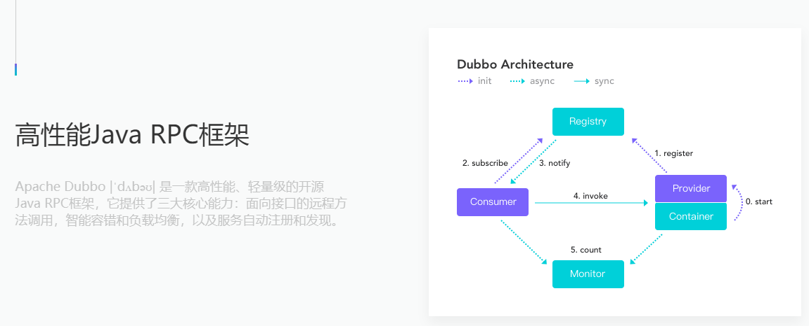
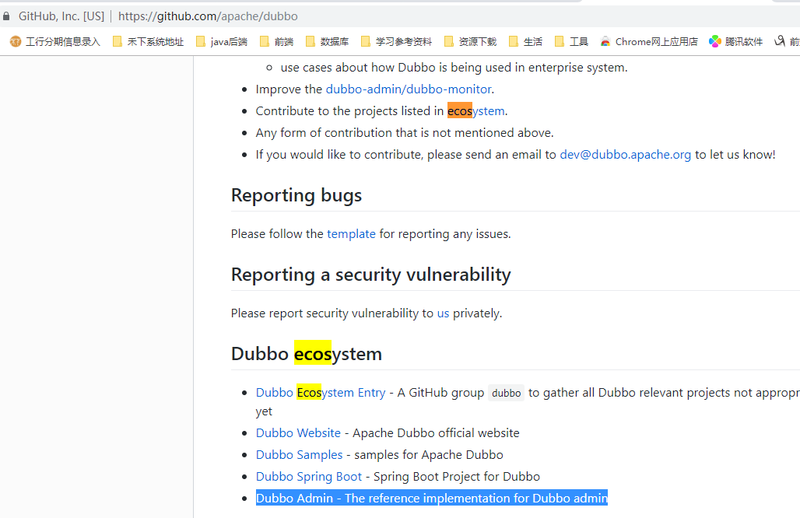

# 常用框架

## dubbo学习笔记

>  [dubbo 官网](http://dubbo.apache.org/zh-cn/docs/user/quick-start.html)

### 安装使用zookeeper注册中心的使用

dubbo支持多种注册中心建议使用zooKeeper，建议下载3.4.x几稳定版[zookeeper下载地址](https://archive.apache.org/dist/zookeeper/ )

> 第一次启动zookeeper`zookeeper-3.4.13\bin` 下 `zkServer.cmd`会报错，需要修改配置文件。  
> > 复制`zookeeper-3.4.13\conf`下`zoo_sample.cfg`改名为`zoo.cfg`，修改里面的dataDir值为`dataDir=../data` 并去`zookeeper-3.4.13\`下创建data文件夹（临时缓存文件夹）
>
> 再次启动`zookeeper-3.4.13\bin` 下 `zkServer.cmd`。并启动zookeeper的客户端`zookeeper-3.4.13\binzkCli.cmd`

### 安装使用监控中心(可视化界面管理控制台)

> [下载地址](https://github.com/apache/dubbo ) 下载好用解压用maven打包`mvn clean package`并运行打包好的jar包`java -jar *.jar` 登录localhost:7001 管理控制台启动需要zookeeper服务程序运行着的。

